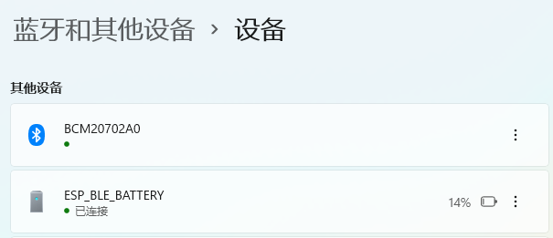
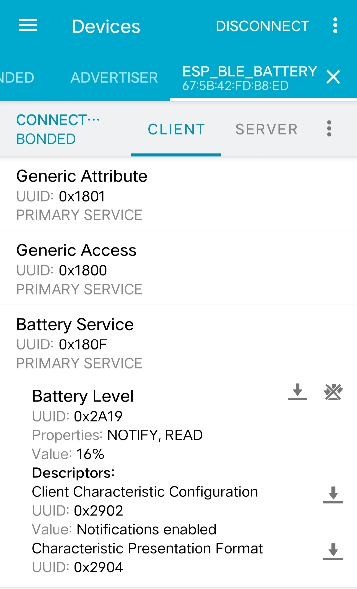
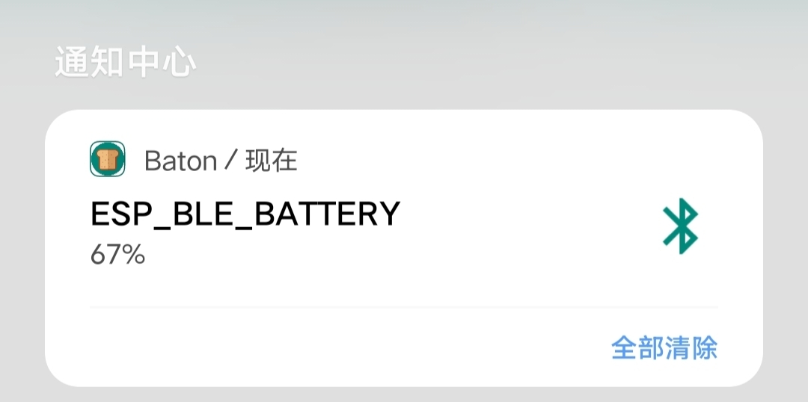

# ESP32 BLE Battery  Service 实现

## 简介

通过 BLE GATT Profile 方式实现 Battery Service, 实现电池电量 notify 给 Client

主要参照 demo:  [gatt_security_server](https://github.com/espressif/esp-idf/tree/master/examples/bluetooth/bluedroid/ble/gatt_security_server) 和  [ble_hid_device_demo](https://github.com/espressif/esp-idf/tree/master/examples/bluetooth/bluedroid/ble/ble_hid_device_demo)

## 修改

在 gatt_security_server 基础上更换 Battery Service 的实现，如下

```c
/*
 *  Battery PROFILE ATTRIBUTES
 ****************************************************************************************
 */
#define CHAR_DECLARATION_SIZE       (sizeof(uint8_t))
static const uint16_t primary_service_uuid         = ESP_GATT_UUID_PRI_SERVICE;
static const uint16_t character_declaration_uuid   = ESP_GATT_UUID_CHAR_DECLARE;
static const uint16_t character_client_config_uuid = ESP_GATT_UUID_CHAR_CLIENT_CONFIG;
static const uint8_t char_prop_read_notify         = ESP_GATT_CHAR_PROP_BIT_READ | ESP_GATT_CHAR_PROP_BIT_NOTIFY;

struct prf_char_pres_fmt
{
    /// Unit (The Unit is a UUID)
    uint16_t unit;
    /// Description
    uint16_t description;
    /// Format
    uint8_t format;
    /// Exponent
    uint8_t exponent;
    /// Name space
    uint8_t name_space;
};

/// battery Service
static const uint16_t battery_svc = ESP_GATT_UUID_BATTERY_SERVICE_SVC;

static const uint16_t bat_lev_uuid = ESP_GATT_UUID_BATTERY_LEVEL;
static const uint8_t   bat_lev_ccc[2] ={ 0x00, 0x00};
static const uint16_t char_format_uuid = ESP_GATT_UUID_CHAR_PRESENT_FORMAT;

static uint8_t battery_lev = 50;

static const esp_gatts_attr_db_t bas_att_db[BAS_IDX_NB] =
{
    // Battery Service Declaration
    [BAS_IDX_SVC]               =  {{ESP_GATT_AUTO_RSP}, {ESP_UUID_LEN_16, (uint8_t *)&primary_service_uuid, ESP_GATT_PERM_READ,
                                            sizeof(uint16_t), sizeof(battery_svc), (uint8_t *)&battery_svc}},

    // Battery level Characteristic Declaration
    [BAS_IDX_BATT_LVL_CHAR]    = {{ESP_GATT_AUTO_RSP}, {ESP_UUID_LEN_16, (uint8_t *)&character_declaration_uuid, ESP_GATT_PERM_READ,
                                                   CHAR_DECLARATION_SIZE,CHAR_DECLARATION_SIZE, (uint8_t *)&char_prop_read_notify}},

    // Battery level Characteristic Value
    [BAS_IDX_BATT_LVL_VAL]             	= {{ESP_GATT_AUTO_RSP}, {ESP_UUID_LEN_16, (uint8_t *)&bat_lev_uuid, ESP_GATT_PERM_READ,
                                                                sizeof(uint8_t),sizeof(uint8_t), &battery_lev}},

    // Battery level Characteristic - Client Characteristic Configuration Descriptor
    [BAS_IDX_BATT_LVL_NTF_CFG]     	=  {{ESP_GATT_AUTO_RSP}, {ESP_UUID_LEN_16, (uint8_t *)&character_client_config_uuid, ESP_GATT_PERM_READ|ESP_GATT_PERM_WRITE,
                                                          sizeof(uint16_t),sizeof(bat_lev_ccc), (uint8_t *)bat_lev_ccc}},

    // Battery level report Characteristic Declaration
    [BAS_IDX_BATT_LVL_PRES_FMT]  = {{ESP_GATT_AUTO_RSP}, {ESP_UUID_LEN_16, (uint8_t *)&char_format_uuid, ESP_GATT_PERM_READ,
                                                        sizeof(struct prf_char_pres_fmt), 0, NULL}},
};
```

Battery Service Declaration 的属性 UUID `ESP_GATT_UUID_BATTERY_SERVICE_SVC` 和 Battery level Characteristic Value 的属性 UUID `ESP_GATT_UUID_BATTERY_LEVEL` 可在 [SIG Assigned Number 16-bit UUIDS](https://btprodspecificationrefs.blob.core.windows.net/assigned-values/16-bit%20UUID%20Numbers%20Document.pdf) 中找到

Battery level Characteristic Value 的值 `battery_lev ` 取值范围应当是 0 ~ 100 之间，表示电量百分比

Battery level Characteristic 的 properties 如下，

| -             | Broadcast | Read | Write without Response | Write | Notify | Indicate | Signed Write | Reliable Write | Writable Auxiliaries |
| ------------- | --------- | ---- | ---------------------- | ----- | ------ | -------- | ------------ | -------------- | -------------------- |
| Battery Level | X         | M    | X                      | X     | O      | X        | X            | X              | X                    |

只允许 Read 和 Notify， 其中 Read 是必须的， Notify是可选的，如果 properties 有 Notify， 必须要有 CCCD 描述符， 同时要定期 Notify 到对端 Client 自己的当前电池电量值

```c
static bool is_notify = false;
static bool is_connected = false;
static void battery_notify_task(void *arg)
{   
    while (1) {
		vTaskDelay(2000 / portTICK_PERIOD_MS);
        if(battery_lev <= 0) battery_lev = 99;
        if(is_notify && is_connected) {
            esp_ble_gatts_send_indicate(battery_profile_tab[BATTERY_PROFILE_APP_IDX].gatts_if, 
                                        battery_profile_tab[BATTERY_PROFILE_APP_IDX].conn_id,
                                        battery_handle_table[BAS_IDX_BATT_LVL_VAL],
                                        sizeof(uint8_t), 
                                        &battery_lev, 
                                        false);
        }
        esp_ble_gatts_set_attr_value(battery_handle_table[BAS_IDX_BATT_LVL_VAL], sizeof(uint8_t), &battery_lev);
        battery_lev -= 2;
    }
    vTaskDelete(NULL);
}
```

以上新建一个 task 用于定期通知 client Battery Level value， `is_notify` 在 `ESP_GATTS_WRITE_EVT` 中赋值， `is_connected` 在 `ESP_GATTS_CONNECT_EVT` 和 `ESP_GATTS_DISCONNECT_EVT` 中赋值， server 不应当在 disconnect 时发送 Notify

`esp_ble_gatts_set_attr_value` 用于设置当前电池电量值，client 去 Read 时会发现电池电量值的变化

```c
static void gatts_profile_event_handler(esp_gatts_cb_event_t event,
                                        esp_gatt_if_t gatts_if, esp_ble_gatts_cb_param_t *param)
{
    ESP_LOGV(GATTS_TABLE_TAG, "event = %x\n",event);
    switch (event) {
        case ESP_GATTS_REG_EVT:
            esp_ble_gap_set_device_name(EXAMPLE_DEVICE_NAME);
            //generate a resolvable random address
            esp_ble_gap_config_local_privacy(true);
            esp_ble_gatts_create_attr_tab(bas_att_db, gatts_if, BAS_IDX_NB, SVC_INST_ID);
            break;
        case ESP_GATTS_READ_EVT:
             ESP_LOGI(GATTS_TABLE_TAG, "ESP_GATTS_READ_EVT, handle = %d,", param->read.handle);
            break;
        case ESP_GATTS_WRITE_EVT:
            ESP_LOGI(GATTS_TABLE_TAG, "GATT_WRITE_EVT, handle = %d, value len = %d, value :", param->write.handle, param->write.len);
            esp_log_buffer_hex(GATTS_TABLE_TAG, param->write.value, param->write.len);
            if (battery_handle_table[BAS_IDX_BATT_LVL_NTF_CFG] == param->write.handle && param->write.len == 2){
                uint16_t descr_value = param->write.value[1]<<8 | param->write.value[0];
                if (descr_value == 0x0001){
                    ESP_LOGI(GATTS_TABLE_TAG, "notify enable");
                    //the size of notify_data[] need less than MTU size
                    is_notify = true;
                    esp_ble_gatts_send_indicate(gatts_if, param->write.conn_id, battery_handle_table[BAS_IDX_BATT_LVL_VAL],
                                            sizeof(uint8_t), &battery_lev, false);
                }else if (descr_value == 0x0002){
                    ESP_LOGE(GATTS_TABLE_TAG, "indicate enable, not supported");
                }
                else if (descr_value == 0x0000){
                    is_notify = false;
                    ESP_LOGI(GATTS_TABLE_TAG, "notify/indicate disable ");
                }else{
                    ESP_LOGE(GATTS_TABLE_TAG, "unknown descr value");
                    esp_log_buffer_hex(GATTS_TABLE_TAG, param->write.value, param->write.len);
                }
            }
            break;
        case ESP_GATTS_CONNECT_EVT:
            ESP_LOGI(GATTS_TABLE_TAG, "ESP_GATTS_CONNECT_EVT");
            is_connected = true;
            battery_profile_tab[BATTERY_PROFILE_APP_IDX].conn_id = param->connect.conn_id;
            /* start security connect with peer device when receive the connect event sent by the master */
            esp_ble_set_encryption(param->connect.remote_bda, ESP_BLE_SEC_ENCRYPT_MITM);
            break;
        case ESP_GATTS_DISCONNECT_EVT:
            ESP_LOGI(GATTS_TABLE_TAG, "ESP_GATTS_DISCONNECT_EVT, disconnect reason 0x%x", param->disconnect.reason);
            is_connected = false;
            /* start advertising again when missing the connect */
            esp_ble_gap_start_advertising(&battery_adv_params);
            break;
        case ESP_GATTS_CREAT_ATTR_TAB_EVT: {
            ESP_LOGI(GATTS_TABLE_TAG, "The number handle = %x",param->add_attr_tab.num_handle);
            if (param->create.status == ESP_GATT_OK){
                if(param->add_attr_tab.num_handle == BAS_IDX_NB) {
                    memcpy(battery_handle_table, param->add_attr_tab.handles,
                    sizeof(battery_handle_table));
                    esp_ble_gatts_start_service(battery_handle_table[BAS_IDX_SVC]);
                }else{
                    ESP_LOGE(GATTS_TABLE_TAG, "Create attribute table abnormally, num_handle (%d) doesn't equal to HRS_IDX_NB(%d)",
                         param->add_attr_tab.num_handle, BAS_IDX_NB);
                }
            }else{
                ESP_LOGE(GATTS_TABLE_TAG, " Create attribute table failed, error code = %x", param->create.status);
            }
        break;
    }
        default:
           break;
    }
}
```

## 使用

1. PC 端蓝牙连接

   搜索到此设备广播，发起连接配对

   

2. 手机端蓝牙连接

   搜索到此设备广播，使用 BLE 调试 APP  nrf connect 发起连接配对，使能 Notify

   

   有个 Baton app 是你点它一下，它主动去 Read 下电量值，不会接收 Notify 的更新

   

