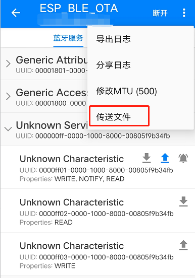
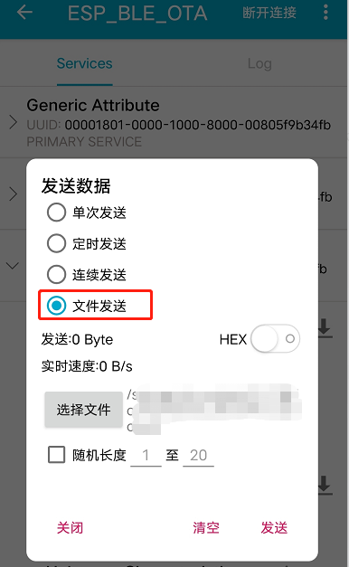

# ESP32 BLE OTA 升级

## 简介

使用手机 能发送文件的 BLE 调试工具给 ESP32 进行固件更新

主要参照 demo:  [gatt_server_service_table](https://github.com/espressif/esp-idf/tree/master/examples/bluetooth/bluedroid/ble/gatt_server_service_table) 和 [native_ota_example](https://github.com/espressif/esp-idf/tree/master/examples/system/ota/native_ota_example)

## OTA

### OTA 数据分区

先来看一张分区表

```
# Name,   Type, SubType, Offset,   Size, Flags
# Note: if you have increased the bootloader size, make sure to update the offsets to avoid overlap
nvs,      data, nvs,     ,        0x4000,
otadata,  data, ota,     ,        0x2000,
phy_init, data, phy,     ,        0x1000,
factory,  app,  factory, ,        0x140000,
ota_0,    app,  ota_0,   ,        0x140000,
ota_1,    app,  ota_1,   ,        0x140000,
```

任何使用 OTA 功能的项目的分区表中都必须包含 OTA 数据分区(类型 `data`，子类型 `ota`,  如分区表中 `otadata` )，上电启动时 boot 会检测OTA 数据分区的内容，来决定启动哪一个 APP 分区，如果 OTA 数据分区没有数据(全 0xFF), 将会启动 `factory`  分区，如果没有 `factory` 分区，将会顺延启动 `ota_0` 分区

假如 `factory`   和 `ota_x` 分区 都有固件，想选择启动其他分区， 可以使用 [otatool.py](https://github.com/espressif/esp-idf/blob/01d014c42d/components/app_update/otatool.py) 工具实现，以下常用的输入命令来对分区进行操作

```shell
# 擦除 otadata,  重设 factory app 为启动分区
otatool.py --port "/dev/ttyUSB1" erase_otadata

# 擦除 OTA app slot 为 0 的分区内容
otatool.py --port "/dev/ttyUSB1" erase_ota_partition --slot 0

# 选择 OTA app slot 为 1 的分区为启动分区
otatool.py --port "/dev/ttyUSB1" switch_ota_partition --slot 1

# 读取 'ota_3'分区内容，保存为 'ota_3.bin' 文件
otatool.py --port "/dev/ttyUSB1" read_ota_partition --name=ota_3 --output=ota_3.bin
```

给每个 app 分区都烧录不同的固件，使用 esptool.py 工具就可以切换不同功能的程序

### APP 版本信息

保存在  `esp_app_desc_t` 结构中，最大 32 字节的字符串 ，修改 APP 版本信息方法

* **CMakeLists.txt 中设置**

  ```
  set(PROJECT_VER "0.1.0.1")
  include($ENV{IDF_PATH}/tools/cmake/project.cmake) # 在此句之前
  ```

* **menuconfig 中设置**

  如果 `CONFIG_APP_PROJECT_VER_FROM_CONFIG` 被设置为 1， 将会是使用 `CONFIG_APP_PROJECT_VER` 覆盖掉 `PROJECT_VER`,  其他设置 `PROJECT_VER` 的方式将不会生效

* **project 目录下 version.txt 文件中设置** 

  如果 `PROJECT_VER`  没有被以上两种方法设置，将会从 `$(PROJECT_PATH)/version.txt` 文件（如果存在）或使用 git 命令 `git describe` 检索 ( IDF 的 example 都是在 ESP-IDF 仓库下，所以显示的 APP version 是 SDK 的信息)， 如果  `PROJECT_VER` 在以上方式都没有设置，则默认为 1

APP 中可以通过 [`esp_ota_get_app_description()`](https://docs.espressif.com/projects/esp-idf/en/latest/esp32/api-reference/system/ota.html#_CPPv427esp_ota_get_app_descriptionv) or [`esp_ota_get_partition_description()`](https://docs.espressif.com/projects/esp-idf/en/latest/esp32/api-reference/system/ota.html#_CPPv433esp_ota_get_partition_descriptionPK15esp_partition_tP14esp_app_desc_t) 来获取 APP 版本信息

### APP 回滚

APP 回滚目的是保持设备在更新后工作，此功能允许回滚到以前的工作应用程序，以防新应用程序出现严重错误

* 应用程序运行良好，`esp_ota_mark_app_valid_cancel_rollback()` 使用状态 `ESP_OTA_IMG_VALID` 标记正在运行的应用程序。 启动此应用程序没有任何限制。
* 应用程序出现严重错误，无法继续工作，需要回滚到前一个应用程序，`esp_ota_mark_app_invalid_rollback_and_reboot() `将正在运行的应用程序标记为 `ESP_OTA_IMG_INVALID` 状态并重置。 引导加载程序不会选择该应用程序进行引导，而是引导之前工作的应用程序。
* 如果设置了 `CONFIG_BOOTLOADER_APP_ROLLBACK_ENABLE` 选项，并且在没有调用任一函数的情况下发生 reset，则应用程序将回滚。

在更新后的 APP 运行到某个阶段，判断是否出现严重问题，如果是，使用 `esp_ota_mark_app_invalid_rollback_and_reboot()` 进行回滚到上一版本

### 恢复出厂设置

menuconfig 中使能 `CONFIG_BOOTLOADER_FACTORY_RESET` , 再配置触发引脚和电平(默认 GPIO4， 低电平触发)， 当下次上电启动时，检查到触发条件，将会将引导分区切换到 `factory ` 分区(如果没有  `factory `  分区，将会切换到 `ota_0` 分区 )

如果以上不使能 `CONFIG_BOOTLOADER_OTA_DATA_ERASE` 选项，似乎恢复出厂设置功能不起啥作用

## 实现

### 传输固件方式

在这里讨论，ESP32 是作为 gatt server 的方式，手机作为 gatt client， 所以向 ESP32 传输固件的方式有 `write command`、`write request` 和 `write prepare request`  方式， 而  `write command`虽然传输快，单 server 收到的可能存在漏包的情况，这样传输来的固件可能不能使用；`write prepare request` 也是需要每一包都要回 `response`， 速度也不快，server 还需要建一个很大的 buffer， 这种方式也不可取，所以只能使用 `write request` 方式

另一个考虑是能发送文件的手机 APP, 目前发现两款 安卓 APP 可以传输文件，都是使用`write request` 方式

[BLE 调试宝](https://www.xuetianli.com/azrj/4559.html)



[BLE 调试助手](https://www.xuetianli.com/azrj/28872.html)



### 修改方法

关于 app 固件的 sha_256 校验、app 回滚等操作，请参考  [native_ota_example](https://github.com/espressif/esp-idf/tree/master/examples/system/ota/native_ota_example)， 这里不做赘述

因为 app 固件没有 size 长度值，所以需要约定下什么时候传输完成，这里采用如下方式

* 使用 `0xFF01`  characteristic 写入固件
* 使用 `0xFF03`  characteristic 写入任意字符表示写入固件完成

建立一个 `ota_example_task`,  如下

```c
static void ota_example_task(void *pvParameter)
{
	// ...
    int binary_file_length = 0;
    /*deal with all receive packet*/
    bool image_header_was_checked = false;
    struct AMessage recv_pxMessage;
    while (1) {
        if(xQueueReceive(data_pointer_queue,  (void *)&recv_pxMessage, portMAX_DELAY)) {
            if(recv_pxMessage.handle == heart_rate_handle_table[IDX_CHAR_VAL_A] && recv_pxMessage.ucData_len > 0) {
                if (image_header_was_checked == false) {
					// 校验固件是否是此芯片可执行固件
                        }
						// 校验固件成功，开始进行 ota
                        image_header_was_checked = true;
                        err = esp_ota_begin(update_partition, OTA_WITH_SEQUENTIAL_WRITES, &update_handle);
						// ...
                        ESP_LOGI(GATTS_TABLE_TAG, "esp_ota_begin succeeded");
                    } else {
                		// 校验固件失败，报错退出
                        task_fatal_error();
                    }
                }
                err = esp_ota_write( update_handle, (const void *)recv_pxMessage.ucData, recv_pxMessage.ucData_len);
				// ...
                binary_file_length += recv_pxMessage.ucData_len;
                ESP_LOGI(GATTS_TABLE_TAG, "Written image length %d", binary_file_length);
            } else if(recv_pxMessage.handle == heart_rate_handle_table[IDX_CHAR_VAL_C] && recv_pxMessage.ucData_len > 0) {
        		// ota 结束
               err = esp_ota_end(update_handle); 
			   // 设置下一次启动分区
                err = esp_ota_set_boot_partition(update_partition);
                if (err != ESP_OK) {
                    ESP_LOGE(GATTS_TABLE_TAG, "esp_ota_set_boot_partition failed (%s)!", esp_err_to_name(err));
                    task_fatal_error();
                }
               // 重启
                esp_restart();
                return;      
            }
            free(recv_pxMessage.ucData);
            esp_ble_gatts_send_response(recv_pxMessage.gatt_if, recv_pxMessage.conn_id, recv_pxMessage.trans_id, ESP_GATT_OK, NULL); 
        }
    }
}
```

`xQueueReceive`  用于接收 `gatts_profile_event_handler` 回调中 `ESP_GATTS_WRITE_EVT` 事件中上报的 `Write Request` 数据，因为 app 固件有个 header 进行校验，所以 BLE 应用层数据包长度不应当小于  `sizeof(esp_image_header_t) + sizeof(esp_image_segment_header_t) + sizeof(esp_app_desc_t))` 的长度

同时应当收到一包确认一包，使用`esp_ble_gatts_send_response` 做出回应，对于 `0xFF01` 和 `0xFF03` characteristic value 的属性控制类型(`esp_attr_control_t`) 应由 协议栈自动响应 `ESP_GATT_AUTO_RSP` 改为 应用层手动响应 `ESP_GATT_RSP_BY_APP`

`ESP_GATTS_WRITE_EVT` 中的处理如下

```c
static void gatts_profile_event_handler(esp_gatts_cb_event_t event, esp_gatt_if_t gatts_if, esp_ble_gatts_cb_param_t *param)
{
    switch (event) {
   		// ...
        case ESP_GATTS_WRITE_EVT:
            if (!param->write.is_prep){
                // the data length of gattc write  must be less than GATTS_DEMO_CHAR_VAL_LEN_MAX.
                uint8_t * spp_cmd_buff = NULL;
                struct AMessage pxMessage;
                spp_cmd_buff = (uint8_t *)malloc(BLE_ONCE_PACKETS_SIZE * sizeof(uint8_t));
                pxMessage.ucData_len = param->write.len;
                memcpy(spp_cmd_buff, param->write.value, param->write.len);
                pxMessage.ucData = spp_cmd_buff;
                pxMessage.need_rep = param->write.need_rsp;
                pxMessage.conn_id = param->write.conn_id;
                pxMessage.trans_id = param->write.trans_id;
                pxMessage.gatt_if = gatts_if;
                pxMessage.handle = param->write.handle;
                xQueueSend(data_pointer_queue,  (void *)&pxMessage, 10/portTICK_PERIOD_MS);

                /* send response when param->write.need_rsp is true*/
                if (param->write.need_rsp){
                    //esp_ble_gatts_send_response(gatts_if, param->write.conn_id, param->write.trans_id, ESP_GATT_OK, NULL);
                }
            }else{
                /* handle prepare write */
                ESP_LOGE(GATTS_TABLE_TAG, "prepare write not supported, use write request!!!");
            }
      	    break;
      // ...
     }
}
```

### 操作步骤

1.  编译固件烧录开发板中，修改 `version.txt` 内容， 重新编译出 APP 固件，并把它转移到手机上
2.  使用 BLE 调试助手 APP 扫描连上设备， 修改 MTU， 选择 `0xFF01` characteristic 进行传输 APP 固件
3.  APP 侧显示传输完成， 选择 `0xFF03` characteristic  写入任意字符，结束 OTA
4.  设备重启，将会加载 新更新的 APP 固件

### 提高 OTA 速度

BLE 传输大文件速度还是有点慢，加快传输固件的方法：

* 更新连接参数， 减小连接间隔
* 若支持 BLE5.0 协议，切换 2M PHY 进行传输
* 使用 `write command` 方式，但不保证不会丢包，如果应用层每一包都使用 notify 确认，速度又不一定提升；如果自己开发 client APP , 给发出的每一包增加 sequence， server 接收检查 sequence ，若发现漏包，再发notify 让 client 重发这一包，可能能提高速度
